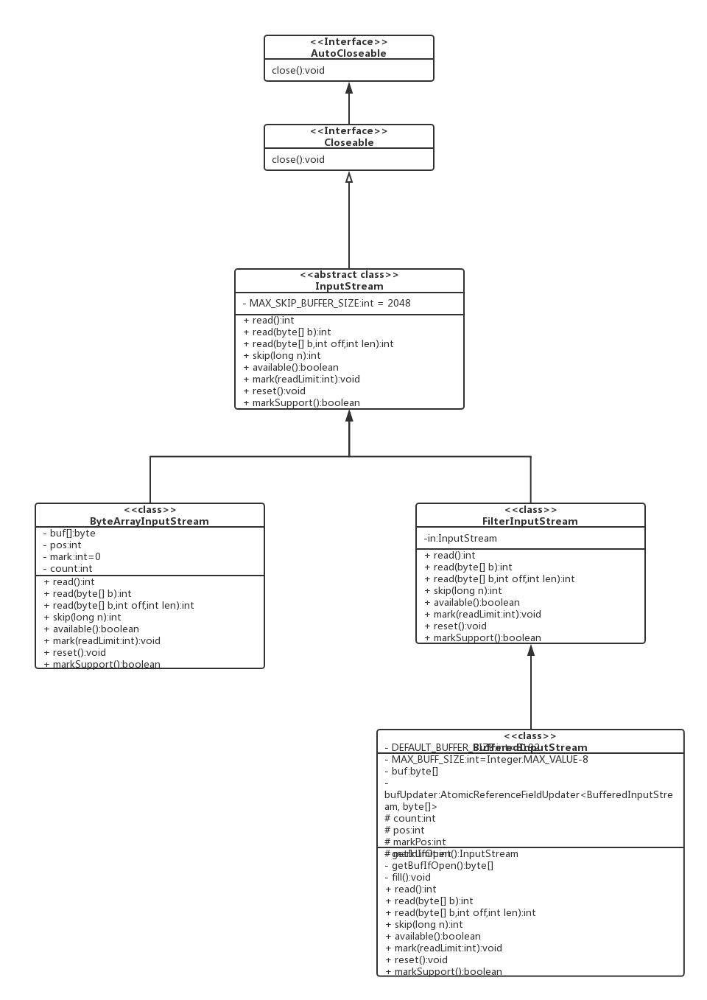

# JAVA IO

## 详解

### AutoCloseable 【interface】

详情参见类[AutoCloseable](../../../src/java/lang/AutoCloseable.java)

Java7引入，作为引入try-with-resources特性的接口。
详情见[try-with-resources](../../feature/try-with-resources.md)

### Closeable 【interface】

* 继承AutoCloseable接口

* 实现者需要保证close方法的幂等性。

详情参见类[Closeable](../../../src/java/io/Closeable.java)

### InputStream

#### InputStream类图

[InputStream接口类图](https://www.processon.com/diagraming/5bdc0abbe4b0844e0bc6478e)

#### InputStream 【abstract class】

* 实现Closeable接口。

* 所有输入字节流类的超类。

* 定义了一个抽象方法read()。这个方法将一直阻塞，除非到达输入流末尾，或者抛出异常。

* 提供mark和reset功能（并非所有input stream都支持这两个功能）

详情参见类[InputStream.java](../../../src/java/io/InputStream.java)

#### FilterInputStream 【class】

* 继承InputStream抽象类

* 引入其他输入流

详情参见类[FilterInputStream.java](../../../src/java/io/FilterInputStream.java)

#### BufferedInputStream 【class】

* 继承FilterInputStream类

* 提供数据缓冲功能

详情参见类[BufferedInputStream.java](../../../src/java/io/BufferedInputStream.java)

### OutputStream

#### OutputStream类图

[OutputStream接口类图](https://www.processon.com/diagraming/5bea314fe4b027a022a10c1e)

#### Flushable 【interface】

* 提供将任何缓冲的输出写入底层流的功能。

详情参见类[Flushable.java](../../../src/java/io/Flushable.java)

#### OutputStream 【abstract class】

* 实现Closeable和Flushable接口

* 所有输出字节流的超类

详情参见类[OutputStream.java](../../../src/java/io/OutputStream.java)

#### FilterOutputStream 【class】

* 继承OutputStream

* 引入其他输出流

详情参见类[OutputStream.java](../../../src/java/io/FilterOutputStream.java)

#### BufferedOutputStream 【class】

* 继承FilterOutputStream

* 提供数据缓冲功能

详情参见类[BufferedOutputStream.java](../../../src/java/io/BufferedOutputStream.java)

### Reader

#### Reader类图

[Reader类图](https://www.processon.com/diagraming/5bea3268e4b0d74dc53c6f75)

#### Readable 【interface】

* 提供将字符通过CharBuffer提供给read方法功能

详情参见类[Readable.java](../../../src/java/lang/Readable.java)

#### Reader 【asbtract class】

* 实现Readable和Closable

* 提供同步锁对象lock

* 提供mark和reset功能（并非所有character input stream都支持这两个功能）

详情参见类[Reader.java](../../../src/java/io/Reader.java)

#### BufferedReader 【class】

* 继承Reader

* 提供字符缓冲功能

详情参见类[BufferedReader.java](../../../src/java/io/BufferedReader.java)

#### CharArrayReader 【class】

* 继承Reader

* 提供字符数组读取功能

详情参见类[CharArrayReader.java](../../../src/java/io/CharArrayReader.java)

### Writer

#### Writer类图

[Writer类图](https://www.processon.com/diagraming/5bea3347e4b0ee74757b1723)

#### Appendable 【interface】

* 字符追加接口

* 线程非安全，线程安全性由实现类实现

详情参见类[Appendable.java](../../../src/java/lang/Appendable.java)

#### Writer 【abstract class】

* 实现Appendable，Closeable，Flushable接口

* 字符写入流抽象实现

* 线程安全

详情参见类[Writer.java](../../../src/java/io/Writer.java)

#### BufferedWriter 【class】

* 继承writer

* 提供字符缓冲功能

详情参见类[BufferedWriter.java](../../../src/java/io/BufferedWriter.java)

#### CharArrayWriter 【class】

* 继承writer

* 提供字符数组读取功能

* 调用close方法时，并不会释放buffer

详情参见类[CharArrayWriter.java](../../../src/java/io/CharArrayWriter.java)